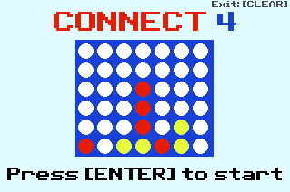
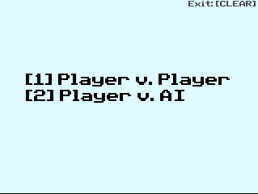
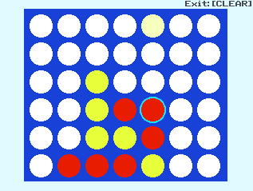
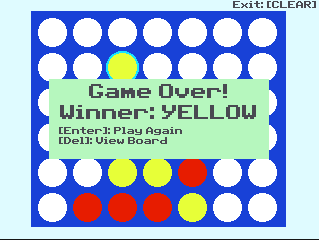

# TI-Connect4

This repository contains the code for TI-Connect4, a Connect 4 game for the TI-84 CE.

## Installation
Upload both the files "TIC4.8xp" and "clibs.8xg" to your calculator using a software such as TI Connect. Run the program in the "prgm" menu in order to play the game.

## Screenshots

## Gameplay
Search up "How to play Connect 4" on Google.

Use the left and right arrow keys to control where to place your marker. Press enter to place your marker. The last placed marker is indicated by the blue outline.

When a winner is declared, you will have the option to play again or look at the state of the board when one player won.

# AI
The AI for this game is implemented using the minimax algorithm with alpha-beta pruning. Optimizations such as bit representation and memoization remain unimplemented.

